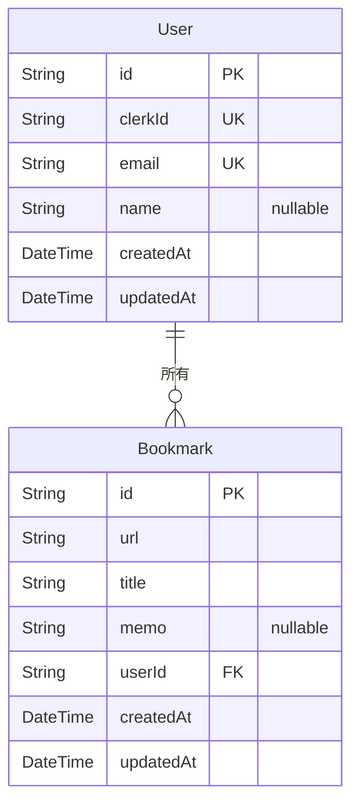

# Schema

## Prisma スキーマ（`prisma/schema.prisma`）

```prisma
// Prisma 7: generator provider は "prisma-client"、output でクライアント生成先を指定
generator client {
  provider = "prisma-client"
  output   = "../src/generated/prisma"
}

// Prisma 7: datasource に URL は書かない。URL は prisma.config.ts で管理する
datasource db {
  provider = "postgresql"
}

model User {
  id        String     @id @default(cuid())
  clerkId   String     @unique @map("clerk_id")
  email     String     @unique
  name      String?
  createdAt DateTime   @default(now()) @map("created_at")
  updatedAt DateTime   @updatedAt @map("updated_at")

  bookmarks Bookmark[]

  @@map("users")
}

model Bookmark {
  id        String   @id @default(cuid())
  url       String
  title     String
  memo      String?
  userId    String   @map("user_id")
  createdAt DateTime @default(now()) @map("created_at")
  updatedAt DateTime @updatedAt @map("updated_at")

  user User @relation(fields: [userId], references: [id], onDelete: Cascade)

  @@index([userId])
  @@map("bookmarks")
}
```

---

## リレーション図



---

## テーブル定義（概要）

### User

| カラム | 型 | 説明 |
|--------|-----|------|
| id | String (CUID) | 主キー |
| clerkId | String | ユニーク。Clerk ユーザー ID（初回ログイン時に同期） |
| email | String | ユニーク。メールアドレス |
| name | String? | 表示名（任意） |
| createdAt | DateTime | 作成日時 |
| updatedAt | DateTime | 更新日時 |

### Bookmark

| カラム | 型 | 説明 |
|--------|-----|------|
| id | String (CUID) | 主キー |
| url | String | ブックマーク URL（http/https のみ） |
| title | String | タイトル（必須、最大 200 文字） |
| memo | String? | メモ（任意、最大 1000 文字） |
| userId | String | 外部キー → User.id（User 削除時に CASCADE） |
| createdAt | DateTime | 作成日時 |
| updatedAt | DateTime | 更新日時 |

---

## インデックス設計

| テーブル | インデックス | 用途 |
|----------|------------|------|
| users | `clerk_id` | Clerk ID による高速ルックアップ（UNIQUE） |
| users | `email` | メールアドレス重複防止（UNIQUE） |
| bookmarks | `user_id` | ユーザー別ブックマーク取得の高速化 |
