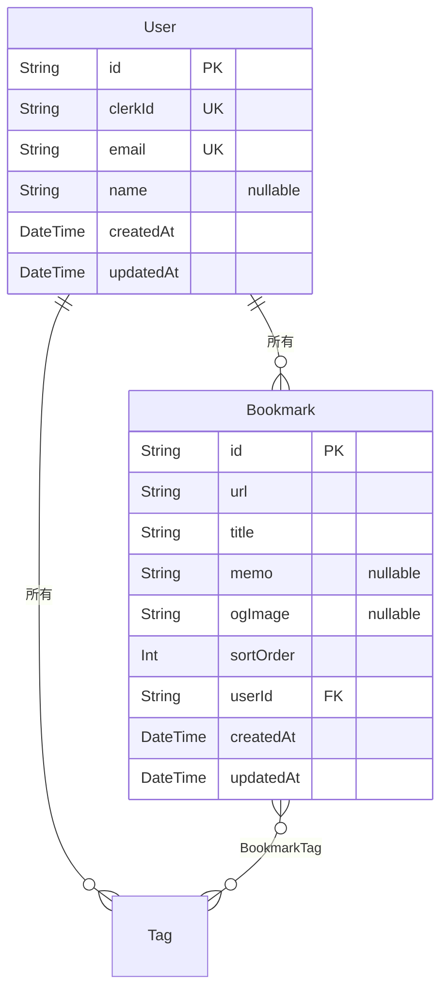

# Schema

## Prisma スキーマ（`prisma/schema.prisma`）

```prisma
// Prisma 7: datasource に URL は書かない。URL は prisma.config.ts で管理する
generator client {
  provider = "prisma-client-js"
}

// Prisma 7: datasource に URL は書かない（prisma.config.ts で管理）
datasource db {
  provider = "postgresql"
}

model User {
  id        String     @id @default(cuid())
  clerkId   String     @unique @map("clerk_id")
  email     String     @unique
  name      String?
  createdAt DateTime   @default(now()) @map("created_at")
  updatedAt DateTime   @updatedAt @map("updated_at")

  bookmarks Bookmark[]

  @@map("users")
}

model Bookmark {
  id        String   @id @default(cuid())
  url       String
  title     String
  memo      String?
  ogImage   String?  @map("og_image")
  sortOrder Int      @default(0) @map("sort_order")
  userId    String   @map("user_id")
  createdAt DateTime @default(now()) @map("created_at")
  updatedAt DateTime @updatedAt @map("updated_at")

  user User          @relation(fields: [userId], references: [id], onDelete: Cascade)
  tags BookmarkTag[]

  @@index([userId])
  @@map("bookmarks")
}

model Tag {
  id        String   @id @default(cuid())
  name      String
  userId    String   @map("user_id")
  createdAt DateTime @default(now()) @map("created_at")

  user      User          @relation(fields: [userId], references: [id], onDelete: Cascade)
  bookmarks BookmarkTag[]

  @@unique([userId, name])
  @@index([userId])
  @@map("tags")
}

model BookmarkTag {
  bookmarkId String @map("bookmark_id")
  tagId      String @map("tag_id")

  bookmark Bookmark @relation(fields: [bookmarkId], references: [id], onDelete: Cascade)
  tag      Tag      @relation(fields: [tagId], references: [id], onDelete: Cascade)

  @@id([bookmarkId, tagId])
  @@map("bookmark_tags")
}
```

---

## リレーション図



---

## テーブル定義（概要）

### User

| カラム | 型 | 説明 |
|--------|-----|------|
| id | String (CUID) | 主キー |
| clerkId | String | ユニーク。Clerk ユーザー ID（初回ログイン時に同期） |
| email | String | ユニーク。メールアドレス |
| name | String? | 表示名（任意） |
| createdAt | DateTime | 作成日時 |
| updatedAt | DateTime | 更新日時 |

### Bookmark

| カラム | 型 | 説明 |
|--------|-----|------|
| id | String (CUID) | 主キー |
| url | String | ブックマーク URL（http/https のみ） |
| title | String | タイトル（必須、最大 200 文字） |
| memo | String? | メモ（任意、最大 1000 文字） |
| ogImage | String? | OGP 画像 URL（URL 入力時に自動取得、任意） |
| sortOrder | Int | 表示順（デフォルト 0、D&D による並び替えで更新） |
| userId | String | 外部キー → User.id（User 削除時に CASCADE） |
| createdAt | DateTime | 作成日時 |
| updatedAt | DateTime | 更新日時 |

---

## テーブル定義（追加分）

### Tag

| カラム | 型 | 説明 |
|--------|-----|------|
| id | String (CUID) | 主キー |
| name | String | タグ名（ユーザー内でユニーク、最大 50 文字） |
| userId | String | 外部キー → User.id（User 削除時に CASCADE） |
| createdAt | DateTime | 作成日時 |

### BookmarkTag

| カラム | 型 | 説明 |
|--------|-----|------|
| bookmarkId | String | 複合主キー。外部キー → Bookmark.id（Bookmark 削除時に CASCADE） |
| tagId | String | 複合主キー。外部キー → Tag.id（Tag 削除時に CASCADE） |

---

## インデックス設計

| テーブル | インデックス | 用途 |
|----------|------------|------|
| users | `clerk_id` | Clerk ID による高速ルックアップ（UNIQUE） |
| users | `email` | メールアドレス重複防止（UNIQUE） |
| bookmarks | `user_id` | ユーザー別ブックマーク取得の高速化 |
| tags | `(user_id, name)` | ユーザー内タグ名のユニーク制約・高速ルックアップ |
| tags | `user_id` | ユーザー別タグ取得の高速化 |
