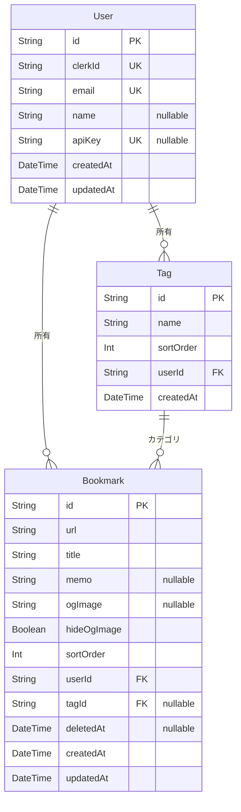

# Schema

スキーマ定義の**正は [`prisma/schema.prisma`](../prisma/schema.prisma)**。本ドキュメントはリレーションと各カラムの**意味**（コードだけでは読み取りにくい制約・用途）を補足する。

---

## リレーション図

```mermaid
erDiagram
    User {
        String id PK
        String clerkId UK
        String email UK
        String name "nullable"
        String apiKey UK "nullable"
        DateTime createdAt
        DateTime updatedAt
    }
    Bookmark {
        String id PK
        String url
        String title
        String memo "nullable"
        String ogImage "nullable"
        Boolean hideOgImage
        Int sortOrder
        String userId FK
        String tagId FK "nullable"
        DateTime deletedAt "nullable"
        DateTime createdAt
        DateTime updatedAt
    }
    Tag {
        String id PK
        String name
        Int sortOrder
        String userId FK
        DateTime createdAt
    }

    User ||--o{ Bookmark : "所有"
    User ||--o{ Tag : "所有"
    Tag ||--o{ Bookmark : "カテゴリ"
```

---

## テーブル定義（概要）

### User

| カラム | 型 | 説明 |
|--------|-----|------|
| id | String (CUID) | 主キー |
| clerkId | String | ユニーク。Clerk ユーザー ID（初回ログイン時に同期） |
| email | String | ユニーク。メールアドレス |
| name | String? | 表示名（任意） |
| apiKey | String? | 外部 REST API 用の API キー（ユニーク・平文）。未発行は null。ヘッダーのモーダルで生成・再生成 |
| createdAt | DateTime | 作成日時 |
| updatedAt | DateTime | 更新日時 |

### Bookmark

| カラム | 型 | 説明 |
|--------|-----|------|
| id | String (CUID) | 主キー |
| url | String | ブックマーク URL（http/https のみ） |
| title | String | タイトル（必須、最大 200 文字） |
| memo | String? | メモ（任意、最大 1000 文字） |
| ogImage | String? | OGP 画像 URL（URL 入力時に自動取得、任意） |
| hideOgImage | Boolean | OGP 画像を一覧で非表示にするか（デフォルト false）。画像 URL は保持し表示のみ切り替える |
| sortOrder | Int | 表示順（デフォルト 0、D&D による並び替えで更新） |
| userId | String | 外部キー → User.id（User 削除時に CASCADE） |
| tagId | String? | 外部キー → Tag.id（Tag 削除時に SET NULL）。カテゴリ分類用。null は「未分類」 |
| deletedAt | DateTime? | ソフトデリート日時。非 null は「ゴミ箱」。一覧取得は `deletedAt IS NULL` のみ対象 |
| createdAt | DateTime | 作成日時 |
| updatedAt | DateTime | 更新日時 |

### Tag

| カラム | 型 | 説明 |
|--------|-----|------|
| id | String (CUID) | 主キー |
| name | String | タグ名（ユーザー内でユニーク、最大 50 文字）。カテゴリとして使用 |
| sortOrder | Int | 表示順（デフォルト 0、D&D による並び替えで更新） |
| userId | String | 外部キー → User.id（User 削除時に CASCADE） |
| createdAt | DateTime | 作成日時 |

---

## インデックス設計

| テーブル | インデックス | 用途 |
|----------|------------|------|
| users | `clerk_id` | Clerk ID による高速ルックアップ（UNIQUE） |
| users | `email` | メールアドレス重複防止（UNIQUE） |
| users | `api_key` | API キーによる認証時の高速ルックアップ（UNIQUE） |
| bookmarks | `user_id` | ユーザー別ブックマーク取得の高速化 |
| bookmarks | `tag_id` | カテゴリ別ブックマーク取得の高速化 |
| tags | `(user_id, name)` | ユーザー内タグ名のユニーク制約・高速ルックアップ |
| tags | `user_id` | ユーザー別タグ取得の高速化 |
