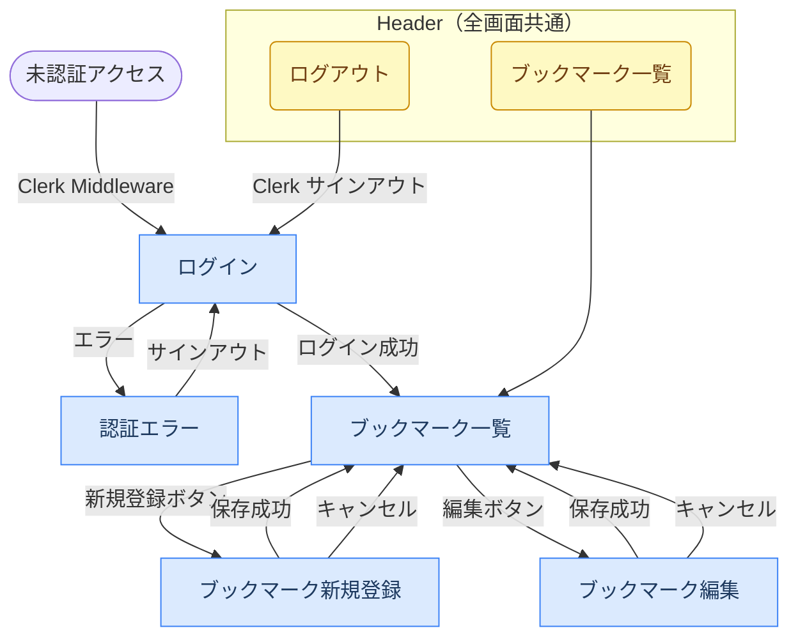

# UI

## 画面一覧

| 画面名 | パス | 認証 | 説明 |
|--------|------|------|------|
| トップ | `/` | 不要 | ログイン画面へリダイレクト |
| ログイン | `/sign-in` | 不要 | Clerk が提供するログイン画面 |
| サインアップ | `/sign-up` | 不要 | Clerk が提供するサインアップ画面 |
| ブックマーク一覧 | `/bookmarks` | 必要 | 自分のブックマーク一覧。新規登録ボタンあり |
| ブックマーク新規登録 | `/bookmarks/new` | 必要 | URL・タイトル・メモを入力して登録 |
| ブックマーク編集 | `/bookmarks/[id]/edit` | 必要 | 既存ブックマークの編集 |
| 認証エラー | `/auth-error` | 不要 | 認証失敗時のエラー表示 |

## 画面遷移図



## 画面機能仕様

### ブックマーク一覧（`/bookmarks`）

- ログインユーザーのブックマークを登録日時降順で表示
- ブックマークが 0 件の場合は「まだブックマークがありません」を表示
- 各ブックマークに編集ボタン・削除ボタンを表示
- 削除は削除ボタンのクリック時に即時実行する（確認ダイアログは表示しない）
- ヘッダーに「新規登録」ボタンを表示

### ブックマーク新規登録（`/bookmarks/new`）

- URL（必須）・タイトル（必須）・メモ（任意）を入力
- クライアント側でバリデーションを実行（空チェック・URL 形式・http/https スキーム）
- 保存後は一覧画面へリダイレクト
- キャンセルボタンで一覧画面へ戻る

### ブックマーク編集（`/bookmarks/[id]/edit`）

- 既存の URL・タイトル・メモを初期値として表示
- バリデーションは新規登録と同様
- 保存後は一覧画面へリダイレクト
- キャンセルボタンで一覧画面へ戻る

## 各画面の表示状態

### ブックマーク一覧（`/bookmarks`）

| 状態 | 条件 | 表示内容 |
|------|------|---------|
| Normal | ブックマークが 1 件以上 | ブックマークカードの一覧を表示 |
| Empty | ブックマークが 0 件 | 「まだブックマークがありません」のメッセージを表示 |
| Error | Server Action 失敗（削除エラーなど） | 削除ボタン直上にエラーメッセージ（`bg-red-50 text-red-600`）を表示 |

### ブックマーク新規登録 / 編集（`/bookmarks/new`, `/bookmarks/[id]/edit`）

| 状態 | 条件 | 表示内容 |
|------|------|---------|
| Normal | 初期表示 | 空フォーム（編集時は既存値で初期化） |
| Submitting | フォーム送信中 | 保存ボタンを「保存中...」に変更し `disabled` |
| ValidationError | クライアントバリデーション失敗 | 各フィールド下にエラーメッセージを表示（`text-red-500`） |
| Error | Server Action 失敗 | フォーム上部にエラーメッセージを表示（`bg-red-50 text-red-600`） |

---

## レイアウト構成

```
src/app/
├── layout.tsx              # ルートレイアウト（ClerkProvider）
├── (auth)/                 # 認証画面グループ（ヘッダーなし）
│   ├── sign-in/            # Clerk ログイン画面
│   └── sign-up/            # Clerk サインアップ画面
├── (dashboard)/            # 認証済み画面グループ
│   ├── layout.tsx          # ダッシュボードレイアウト（ヘッダー含む）
│   └── bookmarks/          # ブックマーク関連画面
│       ├── page.tsx        # 一覧
│       ├── new/page.tsx    # 新規登録
│       ├── [id]/edit/page.tsx  # 編集
│       ├── BookmarkForm.tsx    # 登録・編集共通フォーム
│       └── actions.ts      # Server Actions
└── auth-error/page.tsx     # 認証エラー画面
```

## コンポーネント一覧

| コンポーネント | ファイル | 種別 | 説明 |
|--------------|---------|------|------|
| `BookmarkForm` | `bookmarks/BookmarkForm.tsx` | Client Component | ブックマーク登録・編集フォーム。バリデーション・送信処理を担当 |

## UI 規約

- スタイリング: Tailwind CSS 4
- カラー: blue-600 をプライマリカラーとして使用
- フォーム要素: `rounded border border-gray-300` で統一
- エラー表示: `text-red-500`（フィールド）/ `bg-red-50 text-red-600`（フォーム全体）
- ボタン:
  - 主操作: `bg-blue-600 text-white hover:bg-blue-700`
  - 副操作: `border border-gray-300 text-gray-600 hover:bg-gray-100`
- レスポンシブ: 未対応（MVP スコープ外）
