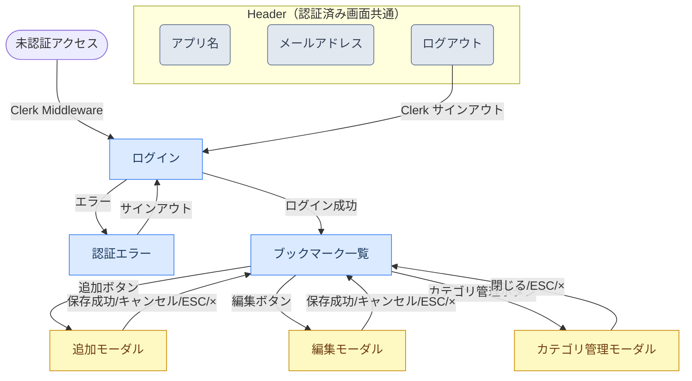

# UI

## 画面一覧

| 画面名 | パス | 認証 | 説明 |
|--------|------|------|------|
| トップ | `/` | 不要 | ログイン画面へリダイレクト |
| ログイン | `/sign-in` | 不要 | Clerk が提供するログイン画面 |
| サインアップ | `/sign-up` | 不要 | Clerk が提供するサインアップ画面 |
| ブックマーク一覧 | `/bookmarks` | 必要 | 自分のブックマーク一覧。追加・編集・削除・カテゴリ管理はモーダルで操作 |
| 認証エラー | `/auth-error` | 不要 | 認証失敗時のエラー表示 |

## 画面遷移図


```mermaid
flowchart TD
    classDef screen fill:#dbeafe,stroke:#3b82f6,color:#1e3a5f
    classDef modal fill:#fef9c3,stroke:#ca8a04,color:#713f12
    classDef nav fill:#e2e8f0,stroke:#64748b,color:#334155

    UNAUTH([未認証アクセス])
    LOGIN[ログイン]:::screen
    AUTH_ERROR[認証エラー]:::screen
    LIST[ブックマーク一覧]:::screen

    ADD_MODAL[追加モーダル]:::modal
    EDIT_MODAL[編集モーダル]:::modal
    TAG_MODAL[カテゴリ管理モーダル]:::modal

    UNAUTH -->|Clerk Middleware| LOGIN
    LOGIN -->|ログイン成功| LIST
    LOGIN -->|エラー| AUTH_ERROR
    AUTH_ERROR -->|サインアウト| LOGIN

    LIST -->|追加ボタン| ADD_MODAL
    LIST -->|編集ボタン| EDIT_MODAL
    LIST -->|カテゴリ管理ボタン| TAG_MODAL

    ADD_MODAL -->|保存成功/キャンセル/ESC/×| LIST
    EDIT_MODAL -->|保存成功/キャンセル/ESC/×| LIST
    TAG_MODAL -->|閉じる/ESC/×| LIST

    subgraph Header ["Header（認証済み画面共通）"]
        direction LR
        H_APP(アプリ名):::nav
        H_EMAIL(メールアドレス):::nav
        H_LOGOUT(ログアウト):::nav
    end

    H_LOGOUT -->|Clerk サインアウト| LOGIN
```

## 画面機能仕様

### ブックマーク一覧（`/bookmarks`）

- ログインユーザーのブックマークをカテゴリごとにグルーピング表示する
- 各カテゴリグループはヘッダー（色丸・カテゴリ名・件数・折りたたみアイコン）を持つ
- カテゴリヘッダーをクリックするとグループを折りたたみ/展開できる
- カテゴリ未設定のブックマークは「未分類」グループに表示される
- ブックマークが 0 件の場合は「まだブックマークがありません」を表示
- 各ブックマークに編集ボタン・削除ボタンを表示
- 削除ボタンをクリックすると即座に UI から非表示になり（楽観的更新）、5 秒後に DB から削除確定する（確認ダイアログは表示しない）
- 5 秒以内に Undo した場合は削除を取り消す
- ヘッダーに「追加」ボタン・「カテゴリ管理」ボタンを表示
- リスト行に OGP サムネイル（og_image）を表示する
- キーワード検索（title / url / memo に対する部分一致）
- 検索ワード入力中はドラッグ＆ドロップを無効化し、ドラッグハンドルを非表示にする
- ドラッグ＆ドロップで並び順を変更できる（ドラッグハンドルをクリックしてドラッグ）
  - カテゴリ内ブックマーク並び替え: `reorderBookmarks()` で DB に保存
  - カテゴリ間ブックマーク移動: `moveBookmark()` で DB に保存
  - カテゴリ順並び替え: `reorderTags()` で DB に保存

### カテゴリ管理モーダル

- 「カテゴリ管理」ボタンで開く
- ログインユーザーが所有するカテゴリを一覧表示する
- 各カテゴリに紐づくブックマーク件数を表示する（例: `3件`）
- カテゴリ名を入力して「作成」で新規カテゴリを作成できる
- 同一ユーザー内で同名カテゴリは作成できない（重複時はエラー「同名のカテゴリが既に存在します」）
- 削除ボタンで対象カテゴリを削除できる（関連するブックマークの tagId は SET NULL → 未分類になる）
- カテゴリが 0 件の場合は「カテゴリがありません」を表示
- ESC キー・オーバーレイクリック・× ボタンで閉じる

### ブックマーク追加モーダル

- 「追加」ボタンで開く
- URL（必須）・タイトル（必須）・メモ（任意）・カテゴリ（任意、単一選択）を入力
- URL 入力時に OGP を自動取得し、タイトル・OGP 画像 URL を補完する
- クライアント側でバリデーションを実行（空チェック・URL 形式・http/https スキーム）
- 保存後はモーダルを閉じて一覧を更新
- ESC キー・オーバーレイクリック・× ボタン・キャンセルボタンで閉じる

### ブックマーク編集モーダル

- 「編集」ボタンで開く
- 既存の URL・タイトル・メモ・カテゴリを初期値として表示
- バリデーションは追加モーダルと同様
- 保存後はモーダルを閉じて一覧を更新（楽観的更新）
- ESC キー・オーバーレイクリック・× ボタン・キャンセルボタンで閉じる

## 各画面の表示状態

### ブックマーク一覧（`/bookmarks`）

| 状態 | 条件 | 表示内容 |
|------|------|---------|
| Normal | ブックマークが 1 件以上、検索なし | カテゴリグループ付きブックマークリストを表示（D&D 有効） |
| Searching | 検索ワード入力中 | カテゴリグループ付きブックマークリストを表示（D&D 無効、ハンドル非表示） |
| Empty | ブックマークが 0 件 | 「まだブックマークがありません」のメッセージを表示 |
| EmptySearch | 検索結果が 0 件 | 「該当するブックマークがありません」のメッセージを表示 |

### カテゴリ管理モーダル

| 状態 | 条件 | 表示内容 |
|------|------|---------|
| Normal | カテゴリが 1 件以上 | カテゴリ一覧（名前・ブックマーク件数・削除ボタン）を表示 |
| Empty | カテゴリが 0 件 | 「カテゴリがありません」のメッセージを表示 |
| Creating | カテゴリ作成中（送信中） | 「作成」ボタンを `disabled`・入力欄も `disabled` |
| Error | 作成・削除失敗 | カテゴリ一覧上部にエラーメッセージを表示 |

### ブックマーク追加・編集モーダル

| 状態 | 条件 | 表示内容 |
|------|------|---------|
| Normal | 初期表示 | 空フォーム（編集時は既存値で初期化） |
| FetchingOgp | OGP取得中 | タイトルラベルに「取得中...」を表示し、保存ボタンを `disabled` |
| Submitting | フォーム送信中 | 保存ボタンを「保存中...」に変更し `disabled` |
| ValidationError | クライアントバリデーション失敗 | 各フィールド下にエラーメッセージを表示（`text-red-500`） |
| Error | Server Action 失敗 | フォーム上部にエラーメッセージを表示（`bg-red-50 text-red-600`） |

---

## レイアウト構成

```
src/app/
├── layout.tsx              # ルートレイアウト（ClerkProvider）
├── page.tsx                # トップ（/bookmarks へリダイレクト）
├── (auth)/                 # 認証画面グループ（ヘッダーなし）
│   ├── sign-in/            # Clerk ログイン画面
│   └── sign-up/            # Clerk サインアップ画面
├── (dashboard)/            # 認証済み画面グループ
│   ├── layout.tsx          # ダッシュボードレイアウト（ヘッダー含む）
│   ├── LogoutButton.tsx    # ログアウトボタン（Clerk useClerk フック使用）
│   └── bookmarks/          # ブックマーク関連画面
│       ├── page.tsx            # 一覧（Server Component）
│       ├── BookmarkForm.tsx    # 登録・編集共通フォーム（OGP 自動取得含む）
│       ├── BookmarkList.tsx    # ブックマーク一覧（カテゴリグルーピング・D&D）
│       ├── BookmarkItemContent.tsx  # ブックマーク行の内容表示
│       ├── SortableBookmarkItem.tsx # ソート可能なブックマーク行
│       ├── CategoryGroup.tsx       # カテゴリグループ（折りたたみ・D&D）
│       ├── CategoryDropZone.tsx    # カテゴリ内ドロップゾーン
│       ├── DragHandleIcon.tsx      # ドラッグハンドルアイコン
│       ├── DeleteButton.tsx        # 削除ボタン（useActionState）
│       ├── UndoSnackbar.tsx        # 削除 Undo スナックバー
│       ├── useDragAndDrop.ts       # D&D ロジックカスタムフック
│       ├── types.ts                # 共通型定義
│       ├── actions.ts             # Server Actions
│       └── fetchOgp.ts            # OGP 取得 Server Action
├── auth-error/page.tsx     # 認証エラー画面
src/components/
├── Header.tsx              # ヘッダー（アプリ名・メール・ログアウト）
├── BookmarkAddModal.tsx    # ブックマーク追加モーダル
├── BookmarkEditModal.tsx   # ブックマーク編集モーダル
├── TagManagementModal.tsx  # カテゴリ管理モーダル
└── icons/
    └── AppIcon.tsx         # アプリアイコン
```

## コンポーネント一覧

| コンポーネント | ファイル | 種別 | 説明 |
|--------------|---------|------|------|
| `BookmarkForm` | `bookmarks/BookmarkForm.tsx` | Client Component | ブックマーク登録・編集フォーム。バリデーション・送信処理・OGP 自動取得・カテゴリ選択を担当 |
| `BookmarkList` | `bookmarks/BookmarkList.tsx` | Client Component | ブックマーク一覧。カテゴリグルーピング・検索・削除操作・楽観的削除/Undo 管理を担当 |
| `BookmarkItemContent` | `bookmarks/BookmarkItemContent.tsx` | Component | ブックマーク行の表示内容（タイトル・URL・メモ・OGP画像・編集/削除ボタン） |
| `SortableBookmarkItem` | `bookmarks/SortableBookmarkItem.tsx` | Component | ソート可能なブックマーク行。`useSortable` で D&D 対応 |
| `CategoryGroup` | `bookmarks/CategoryGroup.tsx` | Client Component | カテゴリグループ。折りたたみ・D&D 対応のカテゴリヘッダーとブックマークリスト |
| `CategoryDropZone` | `bookmarks/CategoryDropZone.tsx` | Component | カテゴリ内の空ドロップゾーン。カテゴリ間ブックマーク移動時の drop target |
| `DragHandleIcon` | `bookmarks/DragHandleIcon.tsx` | Component | ドラッグハンドルの SVG アイコン |
| `DeleteButton` | `bookmarks/DeleteButton.tsx` | Client Component | 削除ボタン。`useActionState` で Server Action を呼び出し |
| `LogoutButton` | `LogoutButton.tsx` | Client Component | ログアウトボタン。Clerk 7 + React 19 対応のため `useClerk` フックで実装 |
| `UndoSnackbar` | `bookmarks/UndoSnackbar.tsx` | Client Component | 削除後 5 秒間表示する Undo スナックバー |
| `Header` | `components/Header.tsx` | Client Component | ヘッダー。アプリ名・メールアドレス・ログアウトボタンを表示 |
| `BookmarkAddModal` | `components/BookmarkAddModal.tsx` | Client Component | ブックマーク追加モーダル。`BookmarkForm` をラップ |
| `BookmarkEditModal` | `components/BookmarkEditModal.tsx` | Client Component | ブックマーク編集モーダル。`BookmarkForm` をラップ |
| `TagManagementModal` | `components/TagManagementModal.tsx` | Client Component | カテゴリ管理モーダル。カテゴリの作成・削除・一覧表示 |

## UI 規約

- スタイリング: Tailwind CSS 4
- カラー: zinc-900 をプライマリカラーとして使用
- フォーム要素: `rounded-md border border-zinc-300` で統一
- エラー表示: `text-red-500`（フィールド）/ `bg-red-50 text-red-600`（フォーム全体）
- ボタン:
  - 主操作: `bg-zinc-900 text-white hover:bg-zinc-700`
  - 副操作: `border border-zinc-300 text-zinc-700 hover:bg-zinc-50`
- レスポンシブ: 未対応（MVP スコープ外）
