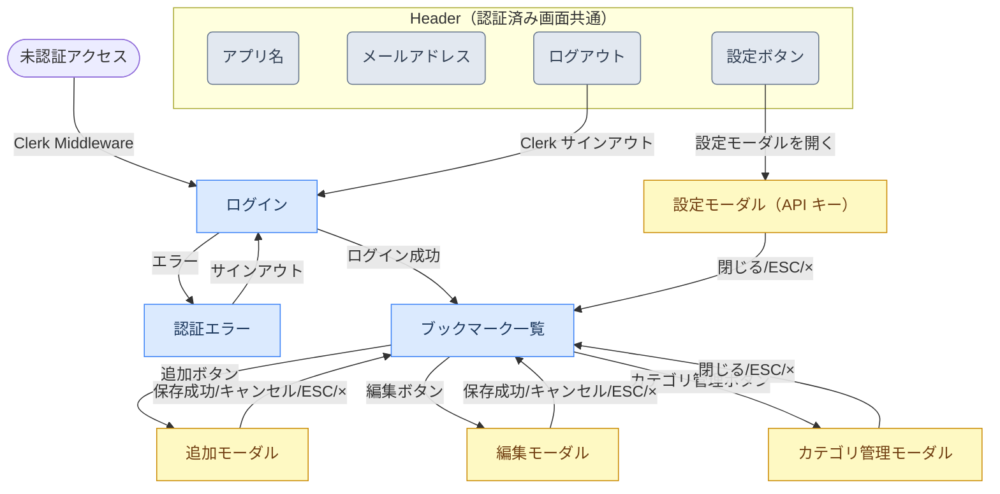

# UI

## 画面一覧

| 画面名 | パス | 認証 | 説明 |
|--------|------|------|------|
| トップ | `/` | 不要 | ログイン画面へリダイレクト |
| ログイン | `/sign-in` | 不要 | Clerk が提供するログイン画面 |
| サインアップ | `/sign-up` | 不要 | Clerk が提供するサインアップ画面 |
| ブックマーク一覧 | `/bookmarks` | 必要 | 自分のブックマーク一覧。追加・編集・削除・カテゴリ管理はモーダルで操作 |
| 認証エラー | `/auth-error` | 不要 | 認証失敗時のエラー表示 |

## 画面遷移図

```mermaid
flowchart TD
    classDef screen fill:#dbeafe,stroke:#3b82f6,color:#1e3a5f
    classDef modal fill:#fef9c3,stroke:#ca8a04,color:#713f12
    classDef nav fill:#e2e8f0,stroke:#64748b,color:#334155

    UNAUTH([未認証アクセス])
    LOGIN[ログイン]:::screen
    AUTH_ERROR[認証エラー]:::screen
    LIST[ブックマーク一覧]:::screen

    ADD_MODAL[追加モーダル]:::modal
    EDIT_MODAL[編集モーダル]:::modal
    TAG_MODAL[カテゴリ管理モーダル]:::modal
    SETTINGS_MODAL[設定モーダル（API キー）]:::modal

    UNAUTH -->|Clerk Middleware| LOGIN
    LOGIN -->|ログイン成功| LIST
    LOGIN -->|エラー| AUTH_ERROR
    AUTH_ERROR -->|サインアウト| LOGIN

    LIST -->|追加ボタン| ADD_MODAL
    LIST -->|編集ボタン| EDIT_MODAL
    LIST -->|カテゴリ管理ボタン| TAG_MODAL

    ADD_MODAL -->|保存成功/キャンセル/ESC/×| LIST
    EDIT_MODAL -->|保存成功/キャンセル/ESC/×| LIST
    TAG_MODAL -->|閉じる/ESC/×| LIST
    SETTINGS_MODAL -->|閉じる/ESC/×| LIST

    subgraph Header ["Header（認証済み画面共通）"]
        direction LR
        H_APP(アプリ名):::nav
        H_EMAIL(メールアドレス):::nav
        H_SETTINGS(設定ボタン):::nav
        H_LOGOUT(ログアウト):::nav
    end

    H_SETTINGS -->|設定モーダルを開く| SETTINGS_MODAL
    H_LOGOUT -->|Clerk サインアウト| LOGIN
```

## 画面機能仕様

### ブックマーク一覧（`/bookmarks`）

- ログインユーザーのブックマークをカテゴリごとにグルーピング表示する
- 各カテゴリグループはヘッダー（色丸・カテゴリ名・件数・折りたたみアイコン）を持つ
- カテゴリヘッダーをクリックするとグループを折りたたみ/展開できる
  - 開閉状態は Cookie（`lh_collapsed_categories`）に保存され、リロード・再訪問時に復元される
  - Cookie はサーバー（`page.tsx`）でも読み取り、初期 HTML を正しい開閉状態でレンダリングする（ハイドレーション時のちらつき防止）
  - 状態が未保存のカテゴリ（新規カテゴリ含む）はデフォルト展開。未分類グループも対象
- カテゴリ内で連続する同一ドメインのブックマークをドメインサブグループとして表示する
  - 連続する同一ドメインが2件以上の場合のみ、ドメインサブグループとして左レール（`border-l-4 border-zinc-400 pl-4` の縦線＋インデント）で範囲を囲み、上部にグローブアイコン・ドメイン名・件数の見出しを表示する
  - 間に別ドメインが挟まる場合はサブグループ化しない（連続判定はカテゴリごとに独立）
  - 同一ドメインが1件のみの場合はサブグループ化せず、追加のラベルも表示しない（URL はタイトル下に表示される）
  - サブグループは表示時のレンダリングのみで、D&D で並び順が変わると動的に再計算される（並び順は尊重し D&D ロジックは変更しない）
- カテゴリ未設定のブックマークは「未分類」グループに表示される
- ブックマークが 0 件の場合は「まだブックマークがありません」を表示
- 各ブックマークに編集ボタン・削除ボタンを表示
- 削除ボタンをクリックすると即座にゴミ箱へ移動する（ソフトデリート・確認ダイアログなし・Undo なし）
- カテゴリ一覧の末尾に「ゴミ箱」グループを表示する（ゴミ箱が空でないときのみ）
  - デフォルトで折りたたみ（閉じた）状態。開閉状態は他カテゴリと同様に Cookie（キー `__trash__`）に保存
  - 各行に「復元」ボタンを表示（編集・削除・D&D は無効）。復元すると元のカテゴリに戻る
  - ヘッダーの「全削除」ボタンでゴミ箱内を完全削除する（不可逆のため確認ダイアログを表示）
- カテゴリの件数バッジはアクティブ（未削除）のブックマークのみを数える
- ヘッダーエリア（検索窓・「カテゴリ管理」ボタン・「追加」ボタン）は1行に横並びで表示し、`sticky` で画面上部に固定する
- ヘッダーエリアの下にカテゴリナビゲーションバーを表示する（色丸・カテゴリ名・件数を横並び表示、クリックで対応カテゴリグループまで自動スクロール）
- リスト行に OGP サムネイル（og_image）を表示する（`hideOgImage` が `true` のブックマークは非表示）
- キーワード検索（title / url / memo に対する部分一致）
- 検索ワード入力中はドラッグ＆ドロップを無効化し、ドラッグハンドルを非表示にする
- ドラッグ＆ドロップで並び順を変更できる（ドラッグハンドルをクリックしてドラッグ）
  - カテゴリ内ブックマーク並び替え: `reorderBookmarks()` で DB に保存
  - カテゴリ間ブックマーク移動: `moveBookmark()` で DB に保存
  - カテゴリ順並び替え: `reorderTags()` で DB に保存

### カテゴリ管理モーダル

- 「カテゴリ管理」ボタンで開く
- ログインユーザーが所有するカテゴリを一覧表示する
- 各カテゴリに紐づくブックマーク件数を表示する（例: `3件`）
- カテゴリ名を入力して「作成」で新規カテゴリを作成できる
- 同一ユーザー内で同名カテゴリは作成できない（重複時はエラー「同名のカテゴリが既に存在します」）
- 各カテゴリの「編集」ボタンで名前をインライン編集できる（入力欄＋「保存」「キャンセル」に切り替わる）
  - Enter で保存、Escape でキャンセル（モーダルは閉じない）
  - 空・50文字超は保存不可。別カテゴリと同名への変更は不可（エラー「同名のカテゴリが既に存在します」）
- 削除ボタンで対象カテゴリを削除できる（関連するブックマークの tagId は SET NULL → 未分類になる）
- カテゴリが 0 件の場合は「カテゴリがありません」を表示
- ESC キー・オーバーレイクリック・× ボタンで閉じる

### ブックマーク追加モーダル

- 「追加」ボタンで開く
- URL（必須）・タイトル（必須）・メモ（任意）・カテゴリ（任意、単一選択）を入力
- URL 入力時に OGP を自動取得し、タイトル・OGP 画像 URL を補完する
- クライアント側でバリデーションを実行（空チェック・URL 形式・http/https スキーム）
- 保存後はモーダルを閉じて一覧を更新
- ESC キー・オーバーレイクリック・× ボタン・キャンセルボタンで閉じる

### ブックマーク編集モーダル

- 「編集」ボタンで開く
- 既存の URL・タイトル・メモ・カテゴリを初期値として表示
- OGP 画像がある場合、サムネイルと「一覧に表示しない」トグル（`hideOgImage`）を表示する。画像 URL 自体は保持し、一覧での表示のみ切り替える
- バリデーションは追加モーダルと同様
- 保存後はモーダルを閉じて一覧を更新（楽観的更新）
- ESC キー・オーバーレイクリック・× ボタン・キャンセルボタンで閉じる

### 設定モーダル

- ヘッダーの設定ボタン（歯車アイコン）で開く
- 「API キー」セクションで外部 REST API（`GET /api/bookmarks`）用の API キーを管理する
- **キーの実値はクライアントに渡さない**。サーバー（`layout.tsx`）が「キーの有無（boolean）」のみを渡し、モーダルは開いたときに実値を取得しない（ローディングやレイアウトのちらつきがない）
- 表示状態は3つ：
  - **未発行**: 「生成する」ボタンのみ
  - **生成・再生成直後**: 実値を入力欄に表示（`type="password"` でマスク・「表示/隠す」トグルで切替）＋「再生成」「失効」。この場で控えないと再表示できない旨を案内する
  - **発行済み（実値非保持）**: マスクされたプレースホルダ（`type="password"`）＋「再生成」「失効」。実値の再表示・コピーは不可
- 「再生成」で新しいキーを発行（旧キーは無効）、「失効」は確認ダイアログを経てキーを無効化（未発行状態に戻す）
- 生成・失効の後は `router.refresh()` でサーバー側の「キー有無」を更新し、閉じて再度開いたときの初期表示（未発行 / 発行済み）を同期する
- ESC キー・オーバーレイクリック・× ボタンで閉じる
- `createPortal` で `document.body` 直下に描画し、`sticky` ヘッダーの stacking context に潜らないようにする

## 各画面の表示状態

### ブックマーク一覧（`/bookmarks`）

| 状態 | 条件 | 表示内容 |
|------|------|---------|
| Normal | ブックマークが 1 件以上、検索なし | カテゴリグループ付きブックマークリストを表示（D&D 有効） |
| Searching | 検索ワード入力中 | カテゴリグループ付きブックマークリストを表示（D&D 無効、ハンドル非表示） |
| Empty | ブックマークが 0 件 | 「まだブックマークがありません」のメッセージを表示 |
| EmptySearch | 検索結果が 0 件 | 「該当するブックマークがありません」のメッセージを表示 |

### カテゴリ管理モーダル

| 状態 | 条件 | 表示内容 |
|------|------|---------|
| Normal | カテゴリが 1 件以上 | カテゴリ一覧（名前・ブックマーク件数・編集/削除ボタン）を表示 |
| Empty | カテゴリが 0 件 | 「カテゴリがありません」のメッセージを表示 |
| Creating | カテゴリ作成中（送信中） | 「作成」ボタンを `disabled`・入力欄も `disabled` |
| Editing | 「編集」クリック中 | 対象行が入力欄＋「保存」「キャンセル」に切り替わる（保存中は `disabled`） |
| Error | 作成・更新・削除失敗 | カテゴリ一覧上部にエラーメッセージを表示 |

### ブックマーク追加・編集モーダル

| 状態 | 条件 | 表示内容 |
|------|------|---------|
| Normal | 初期表示 | 空フォーム（編集時は既存値で初期化） |
| FetchingOgp | OGP取得中 | タイトルラベルに「取得中...」を表示し、保存ボタンを `disabled` |
| Submitting | フォーム送信中 | 保存ボタンを「保存中...」に変更し `disabled` |
| ValidationError | クライアントバリデーション失敗 | 各フィールド下にエラーメッセージを表示（`text-red-500`） |
| Error | Server Action 失敗 | フォーム上部にエラーメッセージを表示（`bg-red-50 text-red-600`） |

---

## ディレクトリ・コンポーネント構成

コンポーネントの一覧・配置・責務は**コードを正**とする（`src/app/(dashboard)/bookmarks/` と `src/components/`）。本ドキュメントには個々のコンポーネント一覧やディレクトリツリーは持たない（実装と乖離しやすいため）。主要な画面・状態・規約のみ上記/下記に記載する。

## UI 規約

- スタイリング: Tailwind CSS 4
- カラー: zinc-900 をプライマリカラーとして使用
- フォーム要素: `rounded-md border border-zinc-300` で統一
- エラー表示: `text-red-500`（フィールド）/ `bg-red-50 text-red-600`（フォーム全体）
- ボタン:
  - 主操作: `bg-zinc-900 text-white hover:bg-zinc-700`
  - 副操作: `border border-zinc-300 text-zinc-700 hover:bg-zinc-50`
- レスポンシブ: 未対応（MVP スコープ外）
